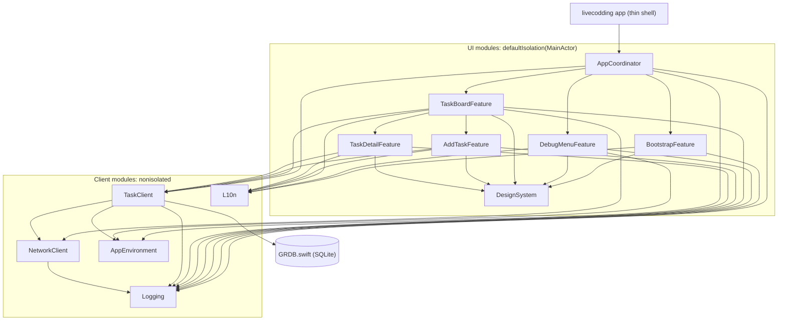
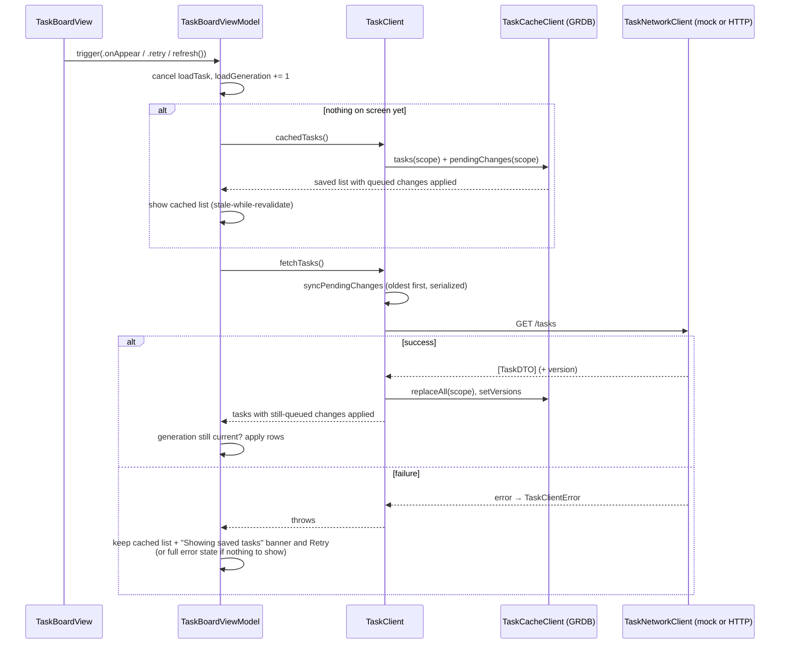
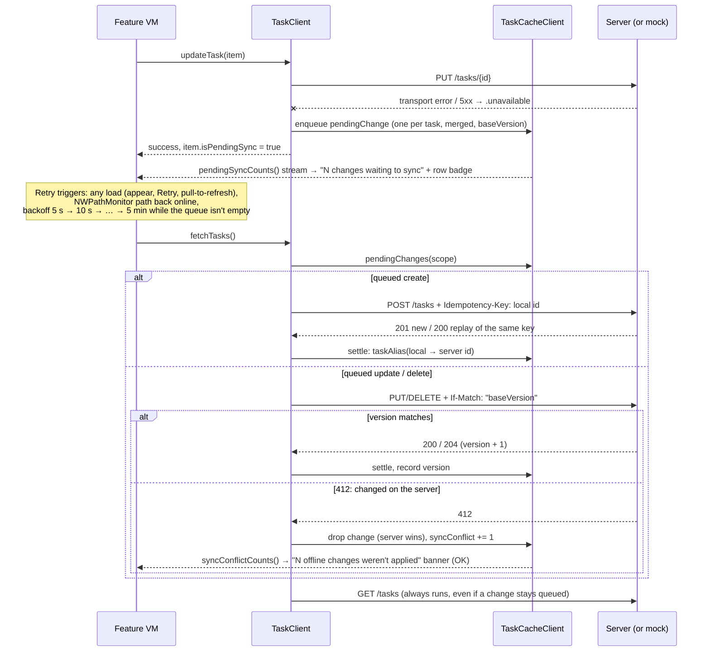
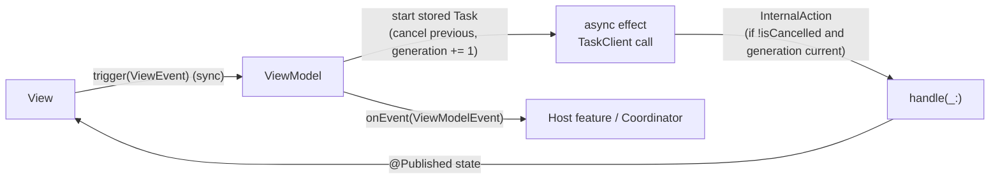

# Architecture — Task Board (iOS)

This page summarises how the app is organised, why, and how it can grow. It links to the detailed
docs rather than repeating them: rules in [`AGENTS.md`](../AGENTS.md), the product spec and decision log
in [`SPEC.md`](SPEC.md), the ADRs in [`decisions/`](decisions/README.md), the module READMEs in
`Modules/Sources/*/README.md` and the API in [`backend/README.md`](../backend/README.md) /
[`openapi.yaml`](../backend/openapi.yaml).

## 1. Context & goals

The [brief](CHALLENGE.md) asked for a Task Board slice: list, add, complete/delete, detail/edit. It
also asked for a **self-built mock network layer** with `async` functions or an `AsyncStream`,
300–800 ms reads and ~15 % failures, and real **loading / empty / error** states. The brief also says
to *"treat it like the start of a real product you'd hand to a team"*, so a few things were added on
purpose after the live session:

- a **Go backend** with the same JSON contract;
- **environments** (`local` mock / `dev` / `prod`) with a debug menu;
- an **offline cache** (stale-while-revalidate) and an **offline change queue**;
- **idempotent creates** and **version-based conflicts**.

The in-app mock is still the default (`local`), so the app meets the brief with no server running
([README ▸ Status](../README.md#status-against-the-brief)).

## 2. Module graph

One local SPM package, [`Modules/Package.swift`](../Modules/Package.swift); the app target links only
`AppCoordinator` ([ADR 0001](decisions/0001-thin-app-shell-local-spm-modules.md)). The edges below come
from `Package.swift`. `swift-dependencies` is used by nearly every module and is left out.

- Imports flow down only: coordinator → features → clients → leaves. Nothing imports `AppCoordinator`.
- A feature imports another feature only to **embed or present it as a child** (TaskBoard → AddTask
  sheet, TaskDetail push). Top-level routing goes through the coordinator
  ([ADR 0002](decisions/0002-root-coordinator-composition-root.md)).
- `TaskBoardFeature` imports `NetworkClient` only for `NetworkMonitorClient` (online/offline hint).
  Features never touch HTTP or GRDB.

## 3. Layers & responsibilities

| Layer | Responsibility |
|---|---|
| **View** | Renders `state` and sends `trigger(.event)`. Holds no logic, no `Task`, no `@Dependency` and does no formatting ([ADR 0003](decisions/0003-mvvm-feature-contract.md)). |
| **ViewModel** | Owns all screen logic and effects: stored tasks, `InternalAction`, one `onEvent` output. |
| **ViewState (+ StateMaker)** | A plain `Equatable` struct with display-ready, localized values. A StateMaker builds the initial state only where that needs dependencies (used only in `DebugMenuFeature`). |
| **AppCoordinator** | Composition root: `AppRoute` → `AppScreen` via a pure `makeScreen`, `didEnter` entry policy, output handling, ordered environment reset. |
| **TaskClient** (repository) | Public domain API (`TaskItem`/`TaskDraft`). Maps DTOs and errors, writes through to the cache, queues offline changes and syncs them before each fetch. |
| **TaskNetworkClient** (internal) | DTO boundary. On every call it picks `MockNetworkClient` (actor) for `local` or HTTP for `dev`/`prod` from `AppEnvironment`. |
| **TaskCacheClient** (internal) | GRDB/SQLite in `Caches`: last known list per environment scope, `pendingChange` queue, `taskAlias`, `taskVersion`, `syncConflict`; migrations. |
| **NetworkClient** | `URLSession` transport, `Endpoint`, typed `NetworkError`, `@concurrent` decoding, sanitized logging middleware, `NetworkMonitorClient`. |

Details: [TaskClient README](../Modules/Sources/TaskClient/README.md),
[NetworkClient README](../Modules/Sources/NetworkClient/README.md),
[AppCoordinator README](../Modules/Sources/AppCoordinator/README.md).

## 4. Data flow

### Board load: cache first, sync, fetch, write-through

- The cache scope (environment) is read **before** the network call, so a response that arrives
  after an environment switch can't land in the new environment.
- If a mutation succeeds while a fetch is in flight, the stale fetch result is dropped and the board
  loads again (`mutationGeneration`).

### Mutation while offline: queue, sync and conflicts

- Only `.unavailable` queues a change. `.validation` and `.notFound` are still thrown. 400/404 during
  sync drop the change (`taskSync.rejected`).
- Before counting a 412 on an update, the sync re-reads the list. If the server already has exactly
  the queued values (an answer that got lost), the change counts as applied.
- Online edits and changes without a known version send no `If-Match` (last write wins).
- Full rules: [SPEC R9](SPEC.md#decision-log) and
  [TaskClient ▸ Offline changes and sync](../Modules/Sources/TaskClient/README.md#offline-changes-and-sync-taskclientsyncswift).

## 5. Presentation pattern

- `trigger` is synchronous. The only async entry point is `refresh()` for `.refreshable`.
- `init(state:)` does no work. Children are created with `withDependencies(from: self)`.
- Contract: [ADR 0003](decisions/0003-mvvm-feature-contract.md) and
  [ADR 0005](decisions/0005-concurrency-default-isolation-stored-tasks.md).

**Optimistic completion** ([SPEC R10](SPEC.md#decision-log)):
- The checkmark flips at once. If the request fails, the row rolls back to the last confirmed value
  with an inline error and Retry.
- Toggles during an in-flight request only change the row. When the request answers, one follow-up
  sends the latest value, so requests for one row never race.
- A reload keeps the shown value of a row with a request in flight. Detail can't open on that row
  until the request answers.

**Swipe-delete with undo** ([SPEC R2](SPEC.md#decision-log)):
- The row hides at once. An undo banner (VoiceOver announced) is shown for 4 s, timed by the injected
  `continuousClock`. Undo restores the row with no request.
- When the window expires, `deleteTask` is sent. A failure restores the row in place with Retry.
  A second swipe commits the pending delete first (one undo slot).
- Delete from detail stays pessimistic, with a confirmation.

## 6. Concurrency

- Swift 6 language mode. Every target enables `NonisolatedNonsendingByDefault` and
  `InferIsolatedConformances` ([`Package.swift`](../Modules/Package.swift)).
- **UI modules** use `.defaultIsolation(MainActor.self)`, so VMs, Views and the coordinator need no
  annotations, and `onEvent` is a plain (non-`@Sendable`) closure.
- **Client modules** are nonisolated. `@DependencyClient` structs are `Sendable` with `@Sendable`
  endpoints. `MockNetworkClient` is an actor.
- **`@concurrent`** marks off-main work: `NetworkClient.decode` / `sendChecked` (the whole HTTP
  exchange and JSON decoding) and opening and migrating the GRDB database.
- **Stored tasks**: each effect is a stored `Task`, cancelled before a restart and in `deinit`, and
  guarded by a generation counter and `Task.isCancelled` after every `await`. There are no `Bool`
  re-entrancy flags. In sync, each send and its `settle` run in a task the caller can't cancel, so a
  cancelled load can't lose a server id.
- Tests never use `Task.sleep` ([§7](#7-dependency-injection--testing)).

## 7. Dependency injection & testing

- **swift-dependencies** `@DependencyClient` structs live in client modules. `liveValue` is set in
  the module, `previewValue` uses canned or instant data, and `testValue = Self()` is unimplemented:
  an endpoint a test didn't stub fails the test
  ([ADR 0004](decisions/0004-dependency-injection-swift-dependencies.md)).
- Consumers use `@Dependency` at class level. Clients resolve their own dependencies **per call**, so
  an environment switch takes effect without rebuilding anything.
- **Tests** ([ADR 0006](decisions/0006-testing-conventions.md)): Swift Testing, Given/When/Then names,
  a per-suite `makeDependencies(&$0)` plus per-test overrides, and no `makeSUT`.
- **Determinism**:
  - `TestClock` drives the undo window and the sync backoff;
  - `MockNetworkPolicy` injects latency, `wait` and `shouldFail` (`.instant` for tests and previews);
  - `AsyncStream` gates hold a request mid-flight;
  - `\.uuid`, `\.date`, `\.calendar` and `\.locale` are overridden;
  - the cache uses an in-memory GRDB database (`TaskCacheClient.inMemory()`).
- **186 `@Test`s** across 10 test targets. They need **no backend and no network**: HTTP tests stub
  the transport. The Go backend has its own `go test -race` suite
  ([backend README](../backend/README.md#run-test-lint)).

## 8. Key decisions & trade-offs

| Decision | Alternatives considered | Why | Cost |
|---|---|---|---|
| **Event-driven MVVM** (`trigger` / `onEvent` / `InternalAction`) | TCA | Gets most of TCA's discipline (one input, one output, explicit effects) without a framework runtime or learning curve. Easy to explain in a team. | Discipline is enforced by convention, templates and review, not by types. More types per feature. [ADR 0003](decisions/0003-mvvm-feature-contract.md) |
| **swift-dependencies** `@DependencyClient` | Protocols + hand-written mocks; manual constructor DI | No protocol/mock pairs to keep in sync. Unimplemented `testValue` fails loudly. Works with a parameter-less VM `init`. | Third-party dependency. Task-local resolution needs `withDependencies(from:)` for children. [ADR 0004](decisions/0004-dependency-injection-swift-dependencies.md) |
| **GRDB** for cache + queue | SwiftData, Core Data, FMDB, Point-Free SQLiteData | Plain SQL with versioned `DatabaseMigrator` migrations. Transactions (send result + `settle` together). `ValueObservation` for the pending/conflict counts. Sendable values, usable from a nonisolated client. | A third-party dependency. Hand-written schema and SQL. [SPEC R8/R9](SPEC.md#decision-log) |
| **One SPM module per feature/client** | Single target with folders, Xcode frameworks, Tuist/XcodeGen | Boundaries are compile-time facts. Faster previews and tests. Almost no `.pbxproj` churn. | `public` boilerplate, `Bundle.module` for resources. [ADR 0001](decisions/0001-thin-app-shell-local-spm-modules.md) |
| **`async` functions** for CRUD (AsyncStream only for counts and connectivity) | An `AsyncStream<[TaskItem]>` data API | Simplest fit for request/response, cancellation and Retry. The brief allows either. | The board patches its list on child events. Live updates are the next step ([§10](#10-evolution--next-steps)). [SPEC R1](SPEC.md#decision-log) |
| **`version` + `If-Match` / 412, server wins** for queued changes | Last write wins everywhere; field-level merge; CRDT | Catches stale offline edits with almost no machinery. Single user, so a merge UI isn't worth it yet. | An offline change can be dropped (it's counted and shown in a banner). Online edits are still last write wins. [SPEC R9](SPEC.md#decision-log) |
| **Pessimistic create/edit** (optimistic completion and swipe-delete only) | Fully optimistic UI | Forms keep the draft and show inline Retry. The server owns ids and validation. Completion and swipe are cheap to roll back. | Visible spinners on save. Offline, a queued change counts as success instead. [SPEC Q5–Q7, R2, R10](SPEC.md#decision-log) |
| **iOS 17.0 target** (brief: iOS 16+) | iOS 16.0 (Xcode 27 still allows deployment targets from iOS 15) | Only the iOS 26.4 and 27.0 simulator runtimes are available on this Xcode/macOS, so an iOS 16 build couldn't be tested. Declaring an untested minimum is worse than an honest 17. iOS 17 adoption is also high for a new product. 17 is still within the brief's "iOS 16+" (SPEC Q9, R6). | Small. Lowering to 16 means: replace the two-parameter `onChange(of:)` calls in `TaskBoardView.swift` (:42, :133) and the `AccessibilityNotification.Announcement` at :44 (iOS 17; `UIAccessibility.post` works on 16); change `platforms` in `Package.swift` and the app's deployment target; test on a device or an older Xcode. [ADR 0005](decisions/0005-concurrency-default-isolation-stored-tasks.md) |
| **Go backend** although the brief says "no backend" | Mock only; a fake HTTP server in-process | Proves the DTO boundary is real: the app switches environments with no change above `TaskNetworkClient`. Exercises HTTP, versions and idempotency end to end. The mock (`local`) stays the default and still satisfies the brief. | A second codebase and contract to maintain ([`openapi.yaml`](../backend/openapi.yaml); a backend test checks the seed copy matches). [SPEC R7](SPEC.md#decision-log) |

## 9. Known limitations

- **Environment switch drops unsynced changes.** The coordinator's ordered reset clears the cache
  and queue ([AppCoordinator README](../Modules/Sources/AppCoordinator/README.md#overlays)).
- **No live data stream.** The board patches its own list from child events. A detail opened on a task
  created offline can fall back to a reload after the id changes.
- **No pagination or delta sync.** `GET /tasks` returns the whole list, and each fetch replaces the
  cache.
- **No auth.** The API has `security: []`, and there's no auth middleware yet.
- **No background sync.** The queue is sent only while the board is alive (loads, path-back,
  backoff). There's no `BGTaskScheduler`.
- **No UI state restoration** (search, sort, open detail). This stretch goal was skipped
  ([README ▸ TODO](../README.md#todo)). There's no custom theming either, only light/dark asset colors.
- **Single-user conflicts only.** The server wins and the change is dropped. There's no merge UI and
  no multi-device awareness. Known sync edge cases are listed in the
  [TaskClient README](../Modules/Sources/TaskClient/README.md#offline-changes-and-sync-taskclientsyncswift).
- **No app-side request ID.** The app doesn't send `X-Request-ID` yet
  ([backend README](../backend/README.md#connecting-the-ios-app)).
- **No CI or lint for the app.** There's no `.github/workflows`. The backend has `make lint`.

## 10. Evolution / next steps

- **Live updates:** `TaskClient.tasks() -> AsyncStream<[TaskItem]>` from GRDB `ValueObservation` over the cache + queue, then server push (SSE/WebSocket) writing into the same cache.
- **Scale the list:** cursor pagination plus delta sync (`GET /tasks?since=<cursor>` returning changes and tombstones).
- **Auth:** an auth middleware with single-flight token refresh on 401 in `NetworkClient` (outside logging, as its README describes), tokens in Keychain, and reset in `switchEnvironment`.
- **Background sync:** `BGTaskScheduler` that calls the existing `fetchTasks()` sync path.
- **Multi-device conflicts:** keep the rejected change and show a "theirs vs mine" choice, or merge per field.
- **Feature growth:** each new screen is a feature module (`ios-feature-module`) plus a coordinator route (`ios-coordinator-route`); the coordinator splits only when a flow gets its own lifecycle.
- **Observability:** send `X-Request-ID` to correlate with server logs, and add an `Analytics` module (`ios-analytics`) with screen-view events owned by VMs.
- **CI:** GitHub Actions for package tests, the app build and `go test`, plus SwiftLint/swift-format.
